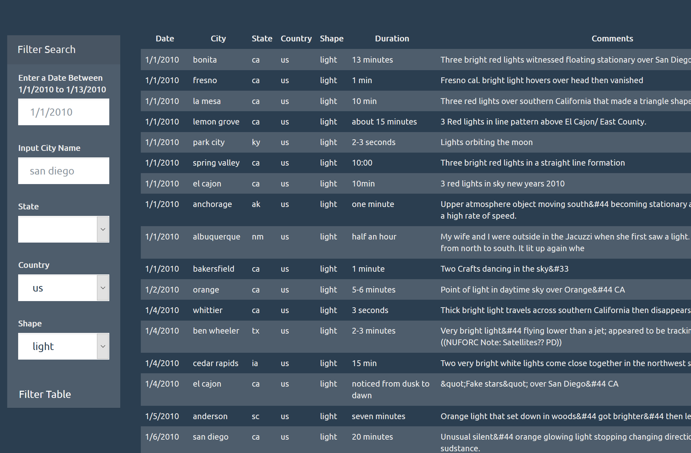

# UFO Sightings Data

## Summary
This repository is for the Javascript assignment for the UCSD Data Bootcamp using the D3.js library for DOM manipulation. The assignment covers the following concepts:
- Dynamically update HTML elements with D3.js tools
- Demonstrating proficiency in basic Javascript functions/methods (.e.g .push(), Object., .forEach(), .filter())
- Using event listeners/handlers to trigger actions on the HTML
- Pull values from user-input forms and reflect webpage accordingly thorugh data output tables
- Dynamically changing dropdown content based on source data

### UFO-level-1
- Application of DOM features and data retrieval, allowing users to filter information from a single field.

### UFO-level-2
- Provides the user the option to filter results from multiple criteria.

## File Overview
### index.html
- Main HTML file edited by D3.js. Offers a form to provide user input, and will display back filtered information using D3.js DOM manipulation to build a table of the data.

### js
- Holds the main .js application and source data.

### app.js
- Main application file for DOM operations. The script will retrieve all data from data.js and use submitQuery() to retrieve user input information from the HTML form and retrieve all data after filtering with the topFilter() function.

### data.js
- Source data file in the format of a JavaScript object.
